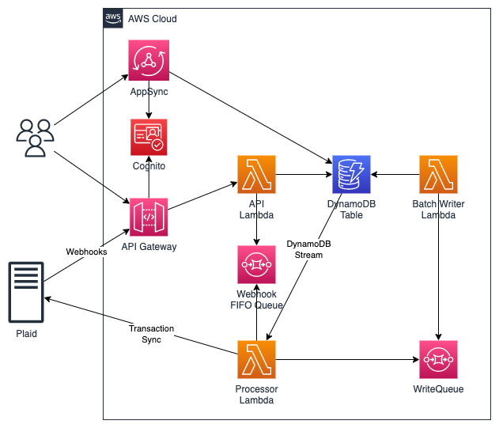

# AWS Plaid Demo

### Table of contents

1. [Introduction](#introduction)
2. [Architecture](#architecture)
3. [Prerequisites](#prerequisites)
4. [Tools and services](#tools-and-services)
5. [Usage](#usage)
6. [Clean up](#clean-up)
7. [Reference](#reference)
8. [Contributing](#contributing)
9. [License](#license)

## Introduction

This repo demonstrates how to build a Fintech app on AWS that uses [Plaid Link](https://plaid.com/plaid-link/) to connect a user to their bank account. The app allows users to sign up using [Amazon Cognito](https://aws.amazon.com/cognito/), select their bank from a list, log in to the bank, and display the accounts. The app is built using [AWS Amplify](https://aws.amazon.com/amplify/), [Amazon API Gateway](https://aws.amazon.com/api-gateway/), Amazon Cognito, [AWS Secrets
Manager](https://aws.amazon.com/secrets-manager/), [Amazon Simple Queue Service](https://aws.amazon.com/sqs/) and [Amazon DynamoDB](https://aws.amazon.com/dynamodb/).

## Architecture



The architecture consists of a [React](https://reactjs.org/) application hosted on [Amplify Hosting](https://aws.amazon.com/amplify/hosting/). The API is an AWS Lambda function behind an Amazon API Gateway. The API stores and retrieves data from DynamoDB. When [webhooks](https://plaid.com/docs/api/webhooks/) are received from Plaid, those are stored in a FIFO SQS queue for processing.

## Prerequisites

- [Python 3](https://www.python.org/downloads/), installed
- [AWS Command Line Interface (AWS CLI)](https://docs.aws.amazon.com/cli/latest/userguide/install-cliv2.html) version 2, installed. Please follow these instructions with how to [setup your AWS credentials](https://docs.aws.amazon.com/serverless-application-model/latest/developerguide/serverless-getting-started-set-up-credentials.html).
- [AWS Serverless Application Model (SAM)](https://docs.aws.amazon.com/serverless-application-model/latest/developerguide/serverless-getting-started.html), installed
- [Docker Desktop](https://www.docker.com/products/docker-desktop), installed
- [GitHub](https://github.com) account
- [Plaid](https://plaid.com/) account

## Tools and services

- [AWS Lambda](https://aws.amazon.com/lambda/) - AWS Lambda is a serverless compute service that lets you run code without provisioning or managing servers, creating workload-aware cluster scaling logic, maintaining event integrations, or managing runtimes.
- [Amazon Cognito](https://aws.amazon.com/cognito/) - Amazon Cognito lets you add user sign-up, sign-in, and access control to your web and mobile apps quickly and easily. Amazon Cognito scales to millions of users and supports sign-in with social identity providers, such as Apple, Facebook, Google, and Amazon, and enterprise identity providers via SAML 2.0 and OpenID Connect.
- [Amazon API Gateway](https://aws.amazon.com/api-gateway/) - Amazon API Gateway is a fully managed service that makes it easy for developers to create, publish, maintain, monitor, and secure APIs at any scale.
- [AWS Amplify](https://aws.amazon.com/amplify/) - AWS Amplify is a complete solution that lets frontend web and mobile developers easily build, ship, and host full-stack applications on AWS, with the flexibility to leverage the breadth of AWS services as use cases evolve.
- [Amazon Simple Queue Service](https://aws.amazon.com/sqs/) - Amazon Simple Queue Service (SQS) is a fully managed message queuing service that enables you to decouple and scale microservices, distributed systems, and serverless applications.
- [Amazon DynamoDB](https://aws.amazon.com/dynamodb/) - Amazon DynamoDB is a fully managed, serverless, key-value NoSQL database designed to run high-performance applications at any scale.
- [AWS Secrets Manager](https://aws.amazon.com/secrets-manager/) - AWS Secrets Manager helps you manage, retrieve, and rotate database credentials, API keys, and other secrets throughout their lifecycles.
- [AWS CloudFormation](https://aws.amazon.com/cloudformation/) - AWS CloudFormation lets you model, provision, and manage AWS and third-party resources by treating infrastructure as code.

## Usage

#### Parameters

| Parameter         |  Type  |      Default       | Description                        |
| ----------------- | :----: | :----------------: | ---------------------------------- |
| Environment       | String |        dev         | Environment tag                    |
| GitHubOrg         | String |    aws-samples     | Source code GitHub organization    |
| GitHubRepo        | String | aws-plaid-demo-app | Source code GitHub repository      |
| PlaidClientId     | String |                    | Plaid Client ID                    |
| PlaidSecretKey    | String |                    | Plaid Secret Key                   |
| PlaidEnvironment  | String |      sandbox       | Plaid Environment                  |
| GitHubAccessToken | String |                    | GitHub Personal Access Token (PAT) |

#### Installation

1. GitHub: [Create a personal access token](https://docs.github.com/en/authentication/keeping-your-account-and-data-secure/creating-a-personal-access-token) with the `repo` scope selected. The access token will be used by AWS Amplify to securely connect to your GitHub account to access the source code. Amplify will then build, deploy and host the application using [Amplify Hosting](https://aws.amazon.com/amplify/hosting/).
2. GitHub: [Fork the repository to your personal account](https://docs.github.com/en/get-started/quickstart/fork-a-repo#forking-a-repository). This is required so Amplify can access the repository and download the source code.
3. Plaid: Ensure you have both a `client_id` and `Sandbox Secret` available on the [Keys](https://dashboard.plaid.com/team/keys) page

```
git clone https://github.com/<GitHubUserName>/aws-plaid-demo-app
cd aws-plaid-demo-app
sam build --use-container --parallel --cached
sam deploy \
  --guided \
  --tags "GITHUB_ORG=<GitHubUserName> GITHUB_REPO=aws-plaid-demo-app"
```

SAM will then prompt you to provide values for the missing parameters listed above:

```
Setting default arguments for 'sam deploy'
=========================================
Stack Name [sam-app]: aws-plaid-demo-app
AWS Region [us-east-1]:
Parameter Environment [dev]:
Parameter GitHubOrg: <GitHubUserName>
Parameter GitHubRepo [aws-plaid-demo-app]:
Parameter PlaidClientId: *************
Parameter PlaidSecretKey: *************
Parameter PlaidEnvironment [sandbox]:
Parameter GitHubAccessToken: *************
#Shows you resources changes to be deployed and require a 'Y' to initiate deploy
Confirm changes before deploy [y/N]:
#SAM needs permission to be able to create roles to connect to the resources in your template
Allow SAM CLI IAM role creation [Y/n]:
Capabilities [['CAPABILITY_IAM']]: CAPABILITY_IAM CAPABILITY_AUTO_EXPAND
#Preserves the state of previously provisioned resources when an operation fails
Disable rollback [y/N]:
Save arguments to configuration file [Y/n]:
SAM configuration file [samconfig.toml]:
SAM configuration environment [default]:
```

SAM will then monitor the CloudFormation stack as its being deployed. Once CloudFormation completes, you can access the application within the [Amplify Console](https://console.aws.amazon.com/amplify/home) to monitor the deployment progress.

#### Testing the Application

Click the `FrontendUrl` listed CloudFormation Outputs (or the `Domain` URL from the Amplify Console) to access the application. You should see a screen like this:


Go through the process to create a new account providing your email address for the username. Cognito will send you a verification code to verify your email. Then click on the "Connect with Plaid" button to begin the linking process.


Select "Bank of America" and use these demo credentials:

- Username: `user_good`
- Password: `pass_good`
- Code: `1111`

Continue through the Plaid Link process to have "Bank of America" and its accounts linked to the application.

## Clean up

Deleting the CloudFormation Stack will remove the Lambda functions, Amplify application, API Gateway and DynamoDB table.

```
sam delete
```

## Reference

## Contributing

See [CONTRIBUTING](CONTRIBUTING.md#security-issue-notifications) for more information.

## License

This library is licensed under the MIT-0 License. See the [LICENSE](LICENSE) file.
